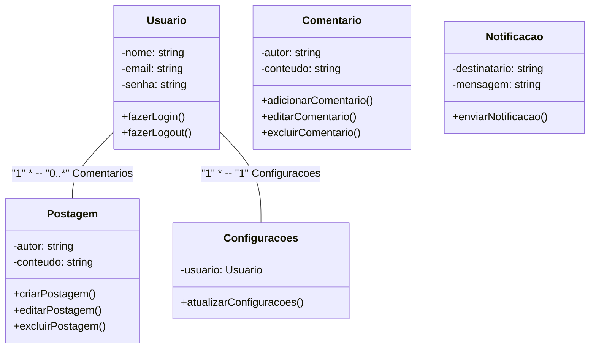

# desafio

```mermaid
classDiagram
  class Usuario {
    -nome: string
    -email: string
    -senha: string
    +fazerLogin()
    +fazerLogout()
  }

  class Postagem {
    -autor: string
    -conteudo: string
    +criarPostagem()
    +editarPostagem()
    +excluirPostagem()
  }

  class Comentario {
    -autor: string
    -conteudo: string
    +adicionarComentario()
    +editarComentario()
    +excluirComentario()
  }

  class Notificacao {
    -destinatario: string
    -mensagem: string
    +enviarNotificacao()
  }

  class Configuracoes {
    -usuario: Usuario
    +atualizarConfiguracoes()
  }

  Usuario -- Postagem: "1" * -- "0..*" Comentarios
  Usuario -- Configuracoes: "1" * -- "1" Configuracoes
```
